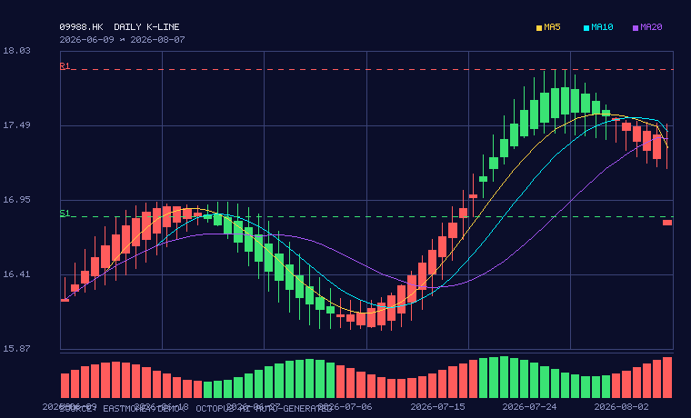

# 04 - 文件合并工具

一个强大的 Python 文件合并工具集，支持多种格式和场景的合并操作。

## 📦 功能特性

### 1. 文件合并 (`merge.py`)
- **文本文件合并** - 支持去重、添加标题、排序、自定义分隔符
- **JSON 文件合并** - 支持深合并、列表拼接/去重策略
- **CSV 文件合并** - 自动对齐不同表头、支持去重
- **二进制文件合并** - 适用于图片、音频等
- **自动检测合并** - 根据扩展名自动选择策略
- **文件夹合并** - 合并多个文件夹，同名文件智能合并

### 2. 归并算法 (`merge_algorithms.py`)
- **合并两个有序数组** - O(n+m)
- **合并 K 个有序数组** - 最小堆实现 O(N log K)
- **归并排序** - 稳定排序 O(n log n)
- **合并区间** - 经典算法题

## 🚀 快速开始

### 安装
```bash
# 无需外部依赖，纯 Python 实现
git clone https://github.com/k-macao/04.git
cd 04
```

### 基本使用

#### Python API
```python
from merge import merge_text_files, merge_json_files, merge_csv_files, merge_files

# 文本合并
merge_text_files(["a.txt", "b.txt"], "merged.txt", deduplicate=True, add_filename_header=True)

# JSON 深合并
merge_json_files(["data1.json", "data2.json"], "merged.json", deep_merge=True)

# CSV 合并，自动对齐表头
merge_csv_files(["a.csv", "b.csv"], "merged.csv", deduplicate=True)

# 自动检测
merge_files(["a.txt", "b.txt"], "out.txt", strategy="auto")

# 文件夹合并
from merge import merge_folders
merge_folders(["folder1", "folder2"], "merged_folder", conflict_strategy="merge")
```

#### 合并算法
```python
from merge_algorithms import merge_two_sorted, merge_k_sorted, merge_sort, merge_intervals

merge_two_sorted([1,3,5], [2,4,6])  # [1,2,3,4,5,6]
merge_k_sorted([[1,4,7],[2,5,8],[3,6,9]])  # [1,2,3,4,5,6,7,8,9]
merge_sort([5,2,8,1,9])
merge_intervals([[1,3],[2,6],[8,10]])
```

### CLI 命令行

```bash
# 文本合并
python merge.py text file1.txt file2.txt -o merged.txt --deduplicate --header --sort

# JSON 合并
python merge.py json data1.json data2.json -o merged.json --deep-merge --list-strategy unique

# CSV 合并
python merge.py csv a.csv b.csv -o merged.csv --deduplicate

# 自动检测
python merge.py auto file1 file2 file3 -o output --strategy auto

# 文件夹合并
python merge.py folder dir1 dir2 -o merged_dir --conflict merge
```

## 📁 项目结构
```
04/
├── merge.py                # 核心文件合并工具
├── merge_algorithms.py     # 归并算法实现
├── test_merge.py           # 测试用例
├── examples/               # 示例文件
│   ├── file1.txt
│   ├── file2.txt
│   ├── data1.json
│   ├── data2.json
│   ├── a.csv
│   └── b.csv
└── README.md
```

## 🧪 运行测试
```bash
python test_merge.py
python merge_algorithms.py
```

## 🔧 高级特性

### 深合并示例
```python
from merge import deep_merge_dicts

base = {"a": 1, "b": {"x": 10}, "c": [1,2]}
incoming = {"b": {"y": 20}, "c": [3,4], "d": 2}
result = deep_merge_dicts(base, incoming)
# {"a": 1, "b": {"x": 10, "y": 20}, "c": [1,2,3,4], "d": 2}
```

### CSV 表头对齐
输入:
- a.csv: id,name,age
- b.csv: id,name,city

输出自动合并为: id,name,age,city，并补全缺失字段

## 📲 微信推送 Workflow（PushPlus + DeepSeek）

仓库内置手动触发的工作流 **Manual Run - Alibaba PushPlus+DeepSeek**（`.github/workflows/r.yml`）：
用 DeepSeek 生成内容，通过 PushPlus 推送到微信。

### 前置条件：配置 Secrets

仓库 **Settings → Secrets and variables → Actions** 中添加：

| Secret 名称 | 何时必需 | 获取方式 |
|---|---|---|
| `PUSHPLUS_TOKEN` | 通道为 `pushplus`/`all` | [pushplus.plus](https://www.pushplus.plus) 登录后个人中心复制 token |
| `DEEPSEEK_API_KEY` | AI 为 `deepseek` | [platform.deepseek.com](https://platform.deepseek.com) 创建 API Key |
| `WECOM_KEY` | 通道为 `wecom`/`all` | 企业微信群机器人 webhook 地址中 `key=` 后的部分 |
| `SERVERCHAN_SENDKEY` | 通道为 `serverchan`/`all` | Server酱 Turbo 的 SendKey |
| `OPENAI_API_KEY` | AI 为 `openai` | OpenAI 控制台（可选变量 `OPENAI_BASE_URL`） |

### 运行方式

**Actions → Manual Run - Alibaba PushPlus+DeepSeek → Run workflow**：

- `dry_run=false`：**真实推送**到微信（默认）
- `dry_run=true`：只生成内容打印到日志，不推送（联调用）
- `channel`：pushplus / wecom / serverchan / console / all
- `ai_provider`：deepseek / rule（固定模板，不耗 API）/ openai
- `topic`：内容主题，留空默认"阿里巴巴(Alibaba) 每日简报"
- `theme`：pushplus 推送的 HTML 主题（整体默认 **game** = 8-bit 像素游戏风：深夜蓝游戏屏 + 金色粗框 + 硬黑像素阴影 + ♥HP血条/★LV/SCORE 游戏元素）；可选 `klein`（米黄纸底 + 黑细框复古）、`pixel`（暗色监控大屏）、`default`（普通 Markdown）
- `hours`：量价舆情动量/十四平台扫描/全市场快讯的数据窗口，支持 24/48/72/**156** 小时（156h≈6.5 天，覆盖一个完整交易周）

主题预览：`examples/theme_preview.html`（game/klein/pixel 三主题对比）与
`examples/game_theme_preview.html`（game 单独大图），可用 `examples/gen_theme_previews.py` 重新生成。

### 📊 推送自带 K 线图（真实图片，微信直接可见）

只要给了 `hk_code`（默认 `09988`），每次推送自动在正文顶部附一张**真实日 K 线图**：

1. **取数**：Yahoo Finance 日 K 为主源，东方财富日 K 兜底（均免 Key，取最近 60 个交易日）
2. **渲染**：纯标准库画 PNG（无第三方依赖）——深夜蓝底、**红涨绿跌** K 线、
   MA5（金）/MA10（青）/MA20（紫）均线、成交量副图、近 20 日 S1/R1 支撑压力位虚线
3. **上传**：GitHub Actions 内自动把 `assets/kline_09988.png` 提交回仓库
   （需 `permissions: contents: write`，已配置），获得公网 raw URL
4. **嵌入**：PushPlus 的 HTML 主题用 `` 内联（微信可直接显示）；
   Server酱 markdown 同样支持；企业微信仅显示为链接



- 任何一步失败（网络/渲染/上传）都会**自动降级**：本次推送不含图片，绝不影响发送
- 本地 `--dry-run`：控制台输出图片本地路径，可直接打开预览
- `--no-kline` 可关闭；同一代码的图片每次运行覆盖更新，raw URL 保持不变
- **权限要求**：把图提交回仓库需要 GITHUB_TOKEN 有 `contents: write`。
  仓库根目录的手动复制版 `R_WORKFLOW_MANUAL_COPY.yml` 与 `WORKFLOW_HARDENED.yml`
  已内置该权限块；若沿用旧的 `.github/workflows/r.yml` 且仓库默认 token 为只读，
  请在 `manual-push` job 下补上：
  ```yaml
  permissions:
    contents: write
  ```
  （缺权限时图片上传自动跳过，其余功能不受影响）

### 分析框架与新增因子

当前工作流提供 12 套模板。选择 `analysis` 时会逐行输出以下 7 个因子，新增的
**量价舆情动量（48h）**不会再被合并到普通消息/情绪面：

1. 基本面（业绩/订单/毛利率）
2. 行业与政策面（平台经济监管/云计算/AI 等真实政策动态）
3. 技术面（趋势/量价/关键价位）
4. 资金面（主力/北向/两融动向）
5. 消息面与情绪面（公告/舆情/行业事件）
6. 估值面（PE/PB 与历史分位）
7. **量价舆情动量（48h）**：基于窗口内价格/成交量、新闻和社媒样本，先本地预聚合，再交给 AI 分析
8. **十四平台股票扫描（窗口跟随 `--hours`，支持 156h）**：输入股票代码后，在最近 156 小时内
   检索十四个平台（**财经 7 源**：Google新闻/财联社电报/华尔街见闻/格隆汇/金十数据/MKTNews/雪球；
   **社媒 7 源**：知乎/微博/抖音/虎扑/AI hot/联合早报/香港01），找出该股票的**相关新闻**
   （按代码/名称/别名直接命中）与**有关板块**（档案预设板块 + 新闻动态提取「XX板块」），
   逐条本地情绪打标后随附录输出，并注入 AI 上下文。

展示样式：`analysis` 输出的「因子 | 方向 | 多头概率 | 依据」在 HTML 推送中以
**卡片式内容展示**（不再是表格）——每个因子一张卡片：卡头为因子名 + 方向徽章
（▲偏多绿 / ▼偏空红 / ●中性灰），卡身为大号多头概率 + 概率条（game 主题为像素
血条 █░，其余主题为细框进度条）和「依据」标签正文；无【方向】列时按概率 50%
上下自动推导徽章。AI/rule 的 Markdown 输出契约不变，卡片化在渲染层完成。

当 `analysis` 搭配 `hk_code` 运行时，脚本会自动采集该新增因子所需的数据；采集失败会明确标注数据缺口，不会伪造概率。

### 统一品牌头与声明

所有模板、所有通道（含 dry-run/console）的最终结果都会自动加入统一品牌信息：

- **标题**：章鱼 AI 全景分析（同时作为推送标题前缀）
- **副标题**：全网多个境内境外多个大模型混合部署 AI 调研平台
- **尾部声明**：声明：仅供参考，不作为投资建议。
- **最后一行作者信息**：`作者：章鱼 ai` 及平台定位说明；不再放在标题下方。

作者和声明由实际推送入口 `pushplus_deepseek.py` 统一组装。企业微信等有长度上限的通道会
按 UTF-8 字节截断正文，但会保留尾部声明和最后一行作者信息。

工作流会先运行 **Check required secrets** 步骤：缺少所需 Secret 时立即变红并指出缺哪一个。

### 数据新鲜度看板（每次推送可验证"有没有更新"）

每次推送正文顶部固定输出 **🧭 数据新鲜度 · 本次运行指纹**：

- **行情对比**：三源共识价 + 在线源数 + 行情时间，并标注与上次推送的涨跌差/持平；
- **🆕 新增样本**：与上次运行相比，数据窗口内新增的条数与来源分布，
  附录中新增条目标 🆕 角标；
- **本地计算**：综合多头概率锚点、量价动量、十四平台命中数；
- **🔢 内容指纹**：由正文+行情+锚点+样本集合计算（不含时间戳）。
  与上次完全一致时醒目标注「⚠️ 与上次推送内容一致（窗口内无新增信号）」，
  否则标注「✅ 与上次推送相比已更新」；首次运行建立基线。

指纹与上次一致且使用 AI 时，会自动追加差异化要求换表述重试一次，避免推文逐字复读。
跨运行状态存于 `output/push_state.json`（已 gitignore），工作流用
`actions/cache` 持久化；本地调试可用环境变量 `PUSH_STATE_PATH` 指定路径，
或 `--no-state` 关闭对比。

命令行本地调试：

```bash
python pushplus_deepseek.py --check-only          # 只检查 Secret 配置
python pushplus_deepseek.py --dry-run             # 生成但不推送
python pushplus_deepseek.py --template analysis --hk-code 09988 --hours 48 --dry-run
python pushplus_deepseek.py --template sentiment --hk-code 09988 --topic 阿里巴巴 --hours 156 --dry-run
python pushplus_deepseek.py --channel all         # 三个通道全部推送
```

### 量价舆情动量 · 十四平台股票扫描（`stock_news_scan.py`）

单独使用（不依赖推送通道，纯标准库）：

```bash
# 输入股票代码，检索最近 156 小时内相关新闻与有关板块
python stock_news_scan.py --code 09988 --name 阿里巴巴 --hours 156

# 只给代码也能跑（内置档案自动补全名称/别名/板块）
python stock_news_scan.py --code 9988.HK

# 追加自定义板块关键词 / JSON 输出 / 离线自检
python stock_news_scan.py --code 00700 --name 腾讯 --sectors 游戏,AI --json
python stock_news_scan.py --selftest
```

输出分三组：**直接相关新闻**（代码/名称/别名命中）、**板块相关快讯**（板块关键词命中）、
**有关板块**（档案预设 + 从命中标题动态提取「XX板块」，子串伪影按频次归属吸收）。
带可靠时间戳的条目严格按 156h 过滤；雪球/社媒热榜为实时快照、标记「实时」不参与过滤。
任何单源失败只进「数据缺口」，不拉高命中数、不伪造数据。

## 📈 免费港股实时行情（`hk_quote.py` + 大屏 view 接入）

大屏监视界面 `server_dashboard.py` 已接入免费港股实时行情，无任何 API Key：

- **数据源对比（2026-08-07 实测）**：① 腾讯财经 `qt.gtimg.cn`（字段最全：现价/开高低/昨收/量额/涨跌/PE/振幅/市值/52周高低/币种）✅ 稳定；② 东方财富 `push2.eastmoney.com`（JSON 最干净，HK 无 PE，偶发 502 自动换 host 重试）✅；③ Yahoo Finance chart API（无 PE/成交额，境内访问不稳）✅ 参考源；新浪 `hq.sinajs.cn`（需 Referer）与 Stooq CSV 实测 ❌。
- **默认链路**：腾讯财经(主) → 东方财富(备) → 静态演示兜底。视图横幅实时显示「🟢 实时行情 (LIVE) · 数据源 · 行情时间」或「⚠️ 演示数据 (STATIC DEMO)」。
- **📊 TradeView 智能行情与 K 线交互视图**：大屏已集成 **TradeView Interactive K-Line & Chart Studio**，支持双引擎双模式切换——① **TradeView 内置交互 K 线**（HTML5 Canvas 极速高帧率渲染、60周期历史与移动均线 MA5/10/20、实时成交量副图、鼠标悬停十字光标 Crosshair 显示完整 OHLCV 详情、智能买卖支撑压力位标注 S1/R1，100% 兼容静态文件与离线环境不白屏）；② **TradingView 官方高级图表控件**（支持一键切换加载官方 `s3.tradingview.com` 实时专业插件）。支持 `09988 阿里巴巴`、`00700 腾讯控股`、`03690 美团`、`BABA 阿里美股` 等多标的，以及分时(1D)/5日(5D)/日K(Daily)/周K/月K 多周期切换。
- **后端接口支持**：前端每 30 秒自动轮询 `/api/quote` 更新价格卡片，`/api/kline` 返回标准化 60 根多空均线 K 线与指标 JSON，`/api/stock` 返回叠加实时行情的完整视图 JSON。

```bash
python hk_quote.py 00700            # 单只股票标准化行情（3 位小数 HKD）
python hk_quote.py --selftest       # 三源真实网络对比测试（哪个好）
python hk_quote.py --fixture-test   # 离线解析自检（内置真实抓包样本）
python test_hk_quote.py             # 单元测试（8 项）
python server_dashboard.py          # 启动大屏（8080，自动接入实时行情）
```

环境变量：`HK_QUOTE_CHAIN=tencent,eastmoney,yahoo`（链路）、`HK_QUOTE_TIMEOUT=3.5`（秒）、`HK_QUOTE_NO_LIVE=1`（强制静态演示）。

## 📝 Git 合并演示

本分支 `arena/019fc917-04` 已实现完整的合并功能，可通过 PR 合并到 main:

```bash
git checkout main
git merge arena/019fc917-04
# 或通过 GitHub PR 合并
```

## License
MIT
